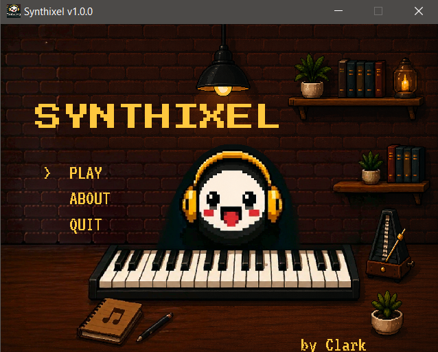
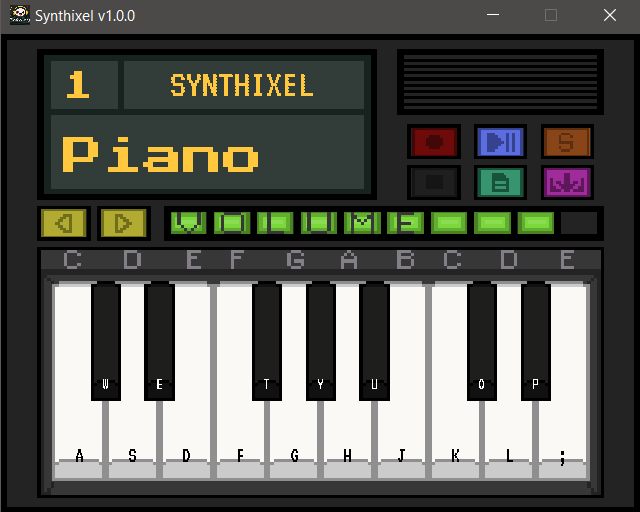

# 🎹 Synthixel
- Synthixel is a simple Java-based piano application built using Swing. <br>
- An open-sourced project design for beginner piano learners. <br>
- Inspired by many virtual piano music software, Synthixel allows users to play piano notes using their keyboard with real-time visual feedback and sound playback.

---
## 📸 Screenshots

| Main Menu | Piano |
|-----------|-------|
|  |  |

---
## ✨ Features

- 🎹 Full playable piano (white + black keys)
- 🎵 Different Instruments (Piano, Organ, Strings, Guitar)
- 💻 Fully customizable open-source project
- ⌨️ Keyboard mapping support
- 🔊 Real-time sound playback using WAV files
- 📁 Export and Import features with files saved in ```.syn``` format
- 🎼 Fully functional recording and sustain feature
- 🖼️ Custom piano key sprites made using Aseprite
- 🖥️ Simple GUI built with Java Swing
- ⚡ Lightweight and fast (no external libraries)

---

## 🎮 How to Play

### White Keys
| Key | Note |
|-----|------|
| A | C |
| S | D |
| D | E |
| F | F |
| G | G |
| H | A |
| J | B |
| K | C2 |
| L | D2 |
| ; | E2 |

### Black Keys
| Key | Note |
|-----|------|
| W | C# |
| E | D# |
| T | F# |
| Y | G# |
| U | A# |
| O | C#2 |
| P | D#2 |

---

## 🎮 How to make the buttons function

### Piano Screen
| Control | KeyCode | Function |
|-----|------|------|
| ↑ | VK_UP | Volume Up |
| ↓ | VK_DOWN | Voulme Down |
| S | VK_SPACE | Sustain |
| ← | VK_LEFT | Instrument Switch |
| → | VK_RIGHT | Instrument Switch |

### Main Menu and Pause
| Control | KeyCode | Function |
|-----|------|------|
| ↑ | VK_UP | Navigate Up |
| ↓ | VK_DOWN | Navigate Down |
| esc | VK_ESCAPE | PAUSE |
| Enter | VK_ENTER | SELECT |

---

## 📁 Project Structure

```
src/
├── audio/
├── input/
├── main/
├── rec/
├── save/
└── ui/
````
````
res/
├── appicon/
├── font/
├── sprite/
├── piano/
├── organ/
├── guitar/
└── strngs/
````

---

## 🚀 How to Run

1. Clone the repository:
```bash
git clone https://github.com/your-username/synthixel.git
````

2. Open in Eclipse / IntelliJ / VS Code

3. Make sure `res/` folder is included in build path

4. Run:

```
/main/Synthixel.java
```

or

```
Get a copy of the release of the current version.
Synthixel_(version).jar
```

---

## 🛠️ Requirements

* Java 17 or higher
* Any Java IDE (Eclipse, IntelliJ, VS Code)

---

## 💡 Notes

* Sound files must be inside `/res/(name of instrument)/`
* Sprite images must be inside `/res/sprite/`
* Uses Java Swing (no external libraries)

---

## 👨‍💻 Author

Made by John Clark Melitar <br>
Project: Synthixel 🎹

---

# 📜 LICENSE 

This project is licensed under the MIT License.  
See the [LICENSE](LICENSE) file for details.
